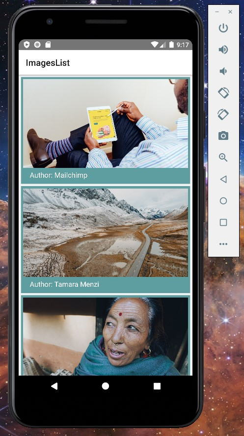

# A react-Native-based gallery that displays photos from Unsplash.

### The application contains two screens:

### List
  - mini image with title and author
  - when the user clicks on the image, the photo screen opens
### Photo
  - displays one photo in its entirety.

## Screenshots

## To run use commands:

    If you use npm:

    - npm run android
    - npm run ios
    - npm run start
    - npm run test
    - npm run lint

    If you use yarn :

    - yarn android
    - yarn ios
    - yarn start
    - yarn test
    - yarn lint
